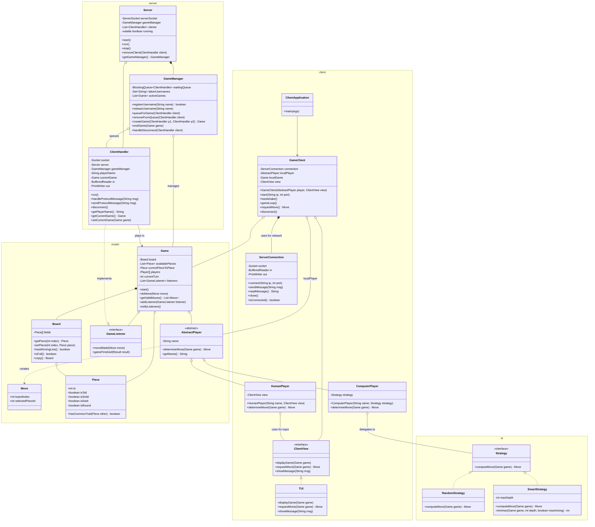

---

## Server System Documentation

### `Server` Class

The main entry point for the server application. Handles TCP connections and delegates client management.

| Method | Description |
|--------|-------------|
| `start()` | Binds the `ServerSocket` to the configured port. Prompts user for a new port if the initial one is unavailable. Sets `running = true`. |
| `run()` | Main server loop. Blocks on `serverSocket.accept()`, creates a new `ClientHandler` for each connection, adds it to the `clients` list, and spawns a new thread for it. Runs until `running = false`. |
| `stop()` | Gracefully shuts down the server. Sets `running = false`, disconnects all `ClientHandler` instances, clears the client list, and closes the `ServerSocket`. |
| `removeClient(ClientHandler)` | Called by a `ClientHandler` when it disconnects. Removes it from the `clients` list. Thread-safe. |
| `getGameManager()` | Returns the singleton `GameManager` instance for client handlers to use. |

---

### `GameManager` Class

Central coordinator for matchmaking, username management, and active game tracking.

| Method | Description |
|--------|-------------|
| `registerUsername(String)` | Attempts to register a username. Returns `true` if successful, `false` if the username is already taken. Thread-safe using synchronized access to `takenUsernames`. |
| `releaseUsername(String)` | Removes a username from the registry. Called when a client disconnects. |
| `queueForGame(ClientHandler)` | Adds a client to the waiting queue. If two players are queued, automatically pairs them and calls `createGame()`. Uses a `BlockingQueue` for thread-safety. |
| `removeFromQueue(ClientHandler)` | Removes a client from the waiting queue (e.g., if they disconnect while waiting). |
| `createGame(ClientHandler, ClientHandler)` | Creates a new `Game` instance, assigns both players, adds it to `activeGames`, notifies both clients that the game has started, and sets `currentGame` on both handlers. |
| `endGame(Game)` | Removes a game from `activeGames`. Called when a game finishes (win/draw) or is terminated due to disconnection. |
| `handleDisconnect(ClientHandler)` | Handles all cleanup when a client disconnects: removes from queue, releases username, notifies opponent if in a game, and ends the game. |

---

### `ClientHandler` Class

Handles all communication with a single connected client. Implements `GameListener` to receive game state updates.

| Method | Description |
|--------|-------------|
| `run()` | Main thread loop. Reads lines from the socket, parses protocol messages, and calls appropriate handlers. On any exception or disconnect, triggers cleanup via `GameManager.handleDisconnect()` and `Server.removeClient()`. |
| `handleProtocolMessage(String)` | Parses and dispatches incoming protocol messages (e.g., `LOGIN`, `QUEUE`, `MOVE`). Validates input and sends error responses for invalid messages. |
| `sendProtocolMessage(String)` | Sends a formatted protocol message to the client. Handles `PrintWriter` synchronization. |
| `disconnect()` | Closes the socket and I/O streams. Called during graceful shutdown or error handling. |
| `getPlayerName()` | Returns the registered username for this client. |
| `getCurrentGame()` | Returns the `Game` this client is currently playing in, or `null` if not in a game. |
| `setCurrentGame(Game)` | Sets the current game reference. Called by `GameManager.createGame()` or `endGame()`. |

---

### Thread Safety Notes

| Component | Synchronization Strategy |
|-----------|-------------------------|
| `Server.clients` | `CopyOnWriteArrayList` — safe for concurrent iteration and modification |
| `GameManager.waitingQueue` | `LinkedBlockingQueue` — thread-safe producer-consumer queue |
| `GameManager.takenUsernames` | `ConcurrentHashMap.newKeySet()` or synchronized `HashSet` |
| `GameManager.activeGames` | `CopyOnWriteArrayList` or synchronized list |
| `ClientHandler.out` | Synchronize on `out` when sending messages to avoid interleaved output |

---

## Client System Documentation

### `GameClient` Class

The main client application that handles network communication and coordinates the local game state.

| Method | Description |
|--------|-------------|
| `GameClient(AbstractPlayer, ClientView)` | Constructor that injects the player (human or AI) and view. Uses composition for flexibility. |
| `connect(ip, port)` | Establishes a TCP connection to the server. |
| `handshake()` | Performs the initial protocol handshake (e.g., sending `HELLO` and `LOGIN` messages). |
| `startListenerLoop()` | Main loop that listens for incoming protocol messages from the server and dispatches them. |
| `requestMove()` | When it's the local player's turn, delegates to `localPlayer.determineMove()` to get the move. |

---

### `HumanPlayer` Class

A concrete player that gets moves from human input via the `ClientView`.

| Method | Description |
|--------|-------------|
| `HumanPlayer(String, ClientView)` | Constructor that sets the player name and view for input. |
| `determineMove(Game)` | Delegates to `view.requestMove()` to prompt the human user for their move. |

---

### `ComputerPlayer` Class

A concrete player that uses an AI strategy to compute moves.

| Method | Description |
|--------|-------------|
| `ComputerPlayer(String, Strategy)` | Constructor that sets the player name and AI strategy. |
| `determineMove(Game)` | Delegates to `strategy.computeMove()` to get the AI-calculated move. |

---

### Design Pattern: Composition over Inheritance

The client uses **composition** instead of inheritance for player types:

```java
// Human player client:
AbstractPlayer player = new HumanPlayer("Alice", tuiView);
GameClient client = new GameClient(player, tuiView);

// AI player client (same GameClient class!):
AbstractPlayer player = new ComputerPlayer("Bot", new SmartStrategy());
GameClient client = new GameClient(player, tuiView);
```

**Benefits:**
- `GameClient` doesn't need subclassing — same class works for human and AI
- Easy to swap player implementations at runtime
- `ComputerPlayer` doesn't inherit network code it doesn't need
- Each class has a single responsibility
