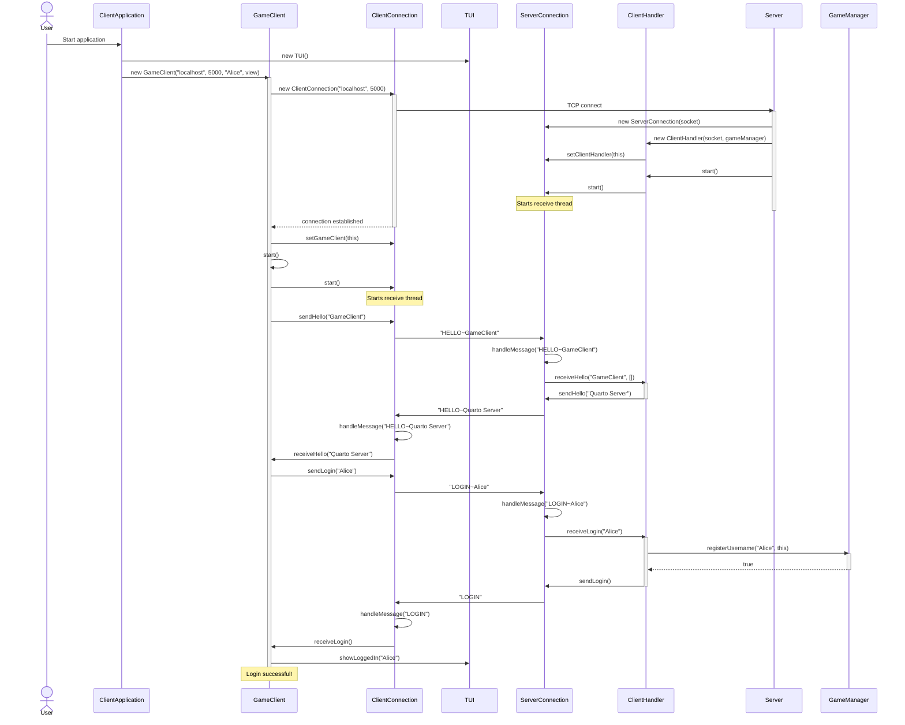
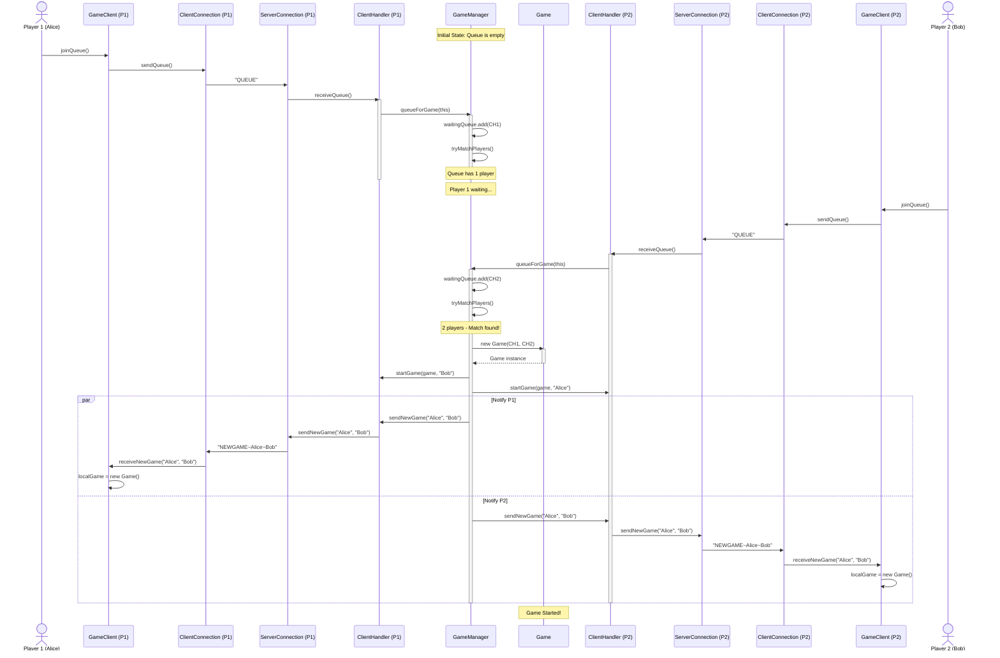
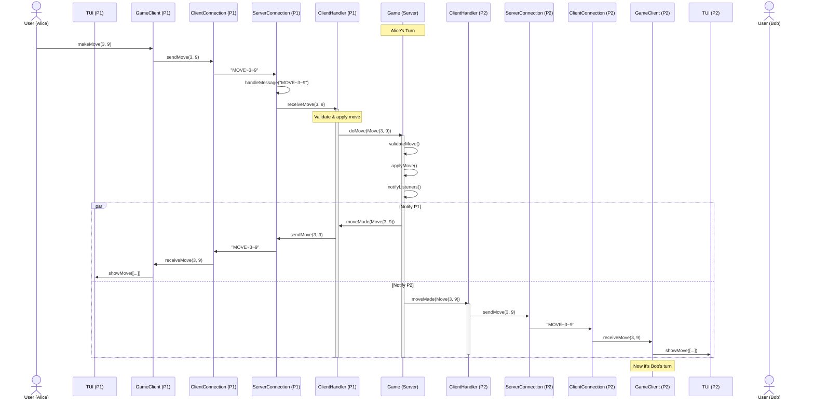
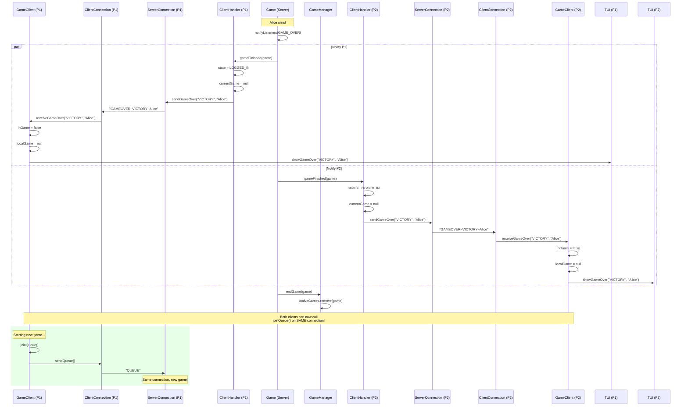
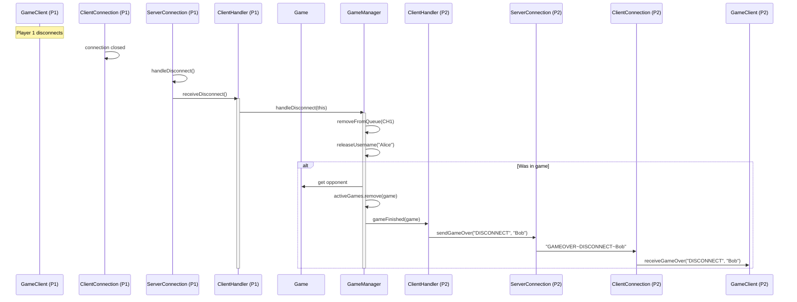

# Sequence Diagrams

## 1. Client Connection & Login

```mermaid
sequenceDiagram
    actor User as User
    participant App as ClientApplication
    participant GC as GameClient
    participant CC as ClientConnection
    participant View as TUI
    participant SC as ServerConnection
    participant CH as ClientHandler
    participant S as Server
    participant GM as GameManager

    User->>App: Start application
    App->>View: new TUI()
    App->>GC: new GameClient("localhost", 5000, "Alice", view)
    activate GC
    GC->>CC: new ClientConnection("localhost", 5000)
    activate CC
    CC->>S: TCP connect
    activate S
    S->>SC: new ServerConnection(socket)
    S->>CH: new ClientHandler(socket, gameManager)
    CH->>SC: setClientHandler(this)
    S->>CH: start()
    CH->>SC: start()
    Note over SC: Starts receive thread
    deactivate S
    CC-->>GC: connection established
    deactivate CC

    GC->>CC: setGameClient(this)
    GC->>GC: start()
    GC->>CC: start()
    Note over CC: Starts receive thread
    GC->>CC: sendHello("GameClient")
    CC->>SC: "HELLO~GameClient"

    SC->>SC: handleMessage("HELLO~GameClient")
    SC->>CH: receiveHello("GameClient", [])
    activate CH
    CH->>SC: sendHello("Quarto Server")
    deactivate CH
    SC->>CC: "HELLO~Quarto Server"

    CC->>CC: handleMessage("HELLO~Quarto Server")
    CC->>GC: receiveHello("Quarto Server")
    GC->>CC: sendLogin("Alice")
    CC->>SC: "LOGIN~Alice"

    SC->>SC: handleMessage("LOGIN~Alice")
    SC->>CH: receiveLogin("Alice")
    activate CH
    CH->>GM: registerUsername("Alice", this)
    activate GM
    GM-->>CH: true
    deactivate GM
    CH->>SC: sendLogin()
    deactivate CH
    SC->>CC: "LOGIN"

    CC->>CC: handleMessage("LOGIN")
    CC->>GC: receiveLogin()
    GC->>View: showLoggedIn("Alice")

    Note over GC: Login successful!
    deactivate GC
```

---

## 2. Queue and Game Start

```mermaid
sequenceDiagram
    actor P1 as Player 1 (Alice)
    participant GC1 as GameClient (P1)
    participant CC1 as ClientConnection (P1)
    participant SC1 as ServerConnection (P1)
    participant CH1 as ClientHandler (P1)
    participant GM as GameManager
    participant Game as Game
    participant CH2 as ClientHandler (P2)
    participant SC2 as ServerConnection (P2)
    participant CC2 as ClientConnection (P2)
    participant GC2 as GameClient (P2)
    actor P2 as Player 2 (Bob)

    Note over GM: Initial State: Queue is empty

    P1->>GC1: joinQueue()
    GC1->>CC1: sendQueue()
    CC1->>SC1: "QUEUE"
    SC1->>CH1: receiveQueue()
    activate CH1
    CH1->>GM: queueForGame(this)
    activate GM
    GM->>GM: waitingQueue.add(CH1)
    GM->>GM: tryMatchPlayers()
    Note over GM: Queue has 1 player
    deactivate GM
    deactivate CH1

    Note over GM: Player 1 waiting...

    P2->>GC2: joinQueue()
    GC2->>CC2: sendQueue()
    CC2->>SC2: "QUEUE"
    SC2->>CH2: receiveQueue()
    activate CH2
    CH2->>GM: queueForGame(this)
    activate GM
    GM->>GM: waitingQueue.add(CH2)
    GM->>GM: tryMatchPlayers()
    Note over GM: 2 players - Match found!

    GM->>Game: new Game(CH1, CH2)
    activate Game
    Game-->>GM: Game instance
    deactivate Game

    GM->>CH1: startGame(game, "Bob")
    GM->>CH2: startGame(game, "Alice")

    par Notify P1
        GM->>CH1: sendNewGame("Alice", "Bob")
        CH1->>SC1: sendNewGame("Alice", "Bob")
        SC1->>CC1: "NEWGAME~Alice~Bob"
        CC1->>GC1: receiveNewGame("Alice", "Bob")
        GC1->>GC1: localGame = new Game()
    and Notify P2
        GM->>CH2: sendNewGame("Alice", "Bob")
        CH2->>SC2: sendNewGame("Alice", "Bob")
        SC2->>CC2: "NEWGAME~Alice~Bob"
        CC2->>GC2: receiveNewGame("Alice", "Bob")
        GC2->>GC2: localGame = new Game()
    end

    deactivate GM
    deactivate CH2

    Note over Game: Game Started!
```

---

## 3. Move Handling

```mermaid
sequenceDiagram
    actor User1 as User (Alice)
    participant View1 as TUI (P1)
    participant GC1 as GameClient (P1)
    participant CC1 as ClientConnection (P1)
    participant SC1 as ServerConnection (P1)
    participant CH1 as ClientHandler (P1)
    participant Game as Game (Server)
    participant CH2 as ClientHandler (P2)
    participant SC2 as ServerConnection (P2)
    participant CC2 as ClientConnection (P2)
    participant GC2 as GameClient (P2)
    participant View2 as TUI (P2)
    actor User2 as User (Bob)

    Note over Game: Alice's Turn

    User1->>GC1: makeMove(3, 9)
    GC1->>CC1: sendMove(3, 9)
    CC1->>SC1: "MOVE~3~9"

    SC1->>SC1: handleMessage("MOVE~3~9")
    SC1->>CH1: receiveMove(3, 9)
    activate CH1

    Note over CH1: Validate & apply move

    CH1->>Game: doMove(Move(3, 9))
    activate Game
    Game->>Game: validateMove()
    Game->>Game: applyMove()
    Game->>Game: notifyListeners()

    par Notify P1
        Game->>CH1: moveMade(Move(3, 9))
        CH1->>SC1: sendMove(3, 9)
        SC1->>CC1: "MOVE~3~9"
        CC1->>GC1: receiveMove(3, 9)
        GC1->>View1: showMove([...])
    and Notify P2
        Game->>CH2: moveMade(Move(3, 9))
        activate CH2
        CH2->>SC2: sendMove(3, 9)
        SC2->>CC2: "MOVE~3~9"
        CC2->>GC2: receiveMove(3, 9)
        GC2->>View2: showMove([...])
        deactivate CH2
    end

    deactivate Game
    deactivate CH1

    Note over GC2: Now it's Bob's turn
```

---

## 4. Game Over & Re-Queue

```mermaid
sequenceDiagram
    participant GC1 as GameClient (P1)
    participant CC1 as ClientConnection (P1)
    participant SC1 as ServerConnection (P1)
    participant CH1 as ClientHandler (P1)
    participant Game as Game (Server)
    participant GM as GameManager
    participant CH2 as ClientHandler (P2)
    participant SC2 as ServerConnection (P2)
    participant CC2 as ClientConnection (P2)
    participant GC2 as GameClient (P2)
    participant View1 as TUI (P1)
    participant View2 as TUI (P2)

    Note over Game: Alice wins!

    Game->>Game: notifyListeners(GAME_OVER)

    par Notify P1
        Game->>CH1: gameFinished(game)
        CH1->>CH1: state = LOGGED_IN
        CH1->>CH1: currentGame = null
        CH1->>SC1: sendGameOver("VICTORY", "Alice")
        SC1->>CC1: "GAMEOVER~VICTORY~Alice"
        CC1->>GC1: receiveGameOver("VICTORY", "Alice")
        GC1->>GC1: inGame = false
        GC1->>GC1: localGame = null
        GC1->>View1: showGameOver("VICTORY", "Alice")
    and Notify P2
        Game->>CH2: gameFinished(game)
        CH2->>CH2: state = LOGGED_IN
        CH2->>CH2: currentGame = null
        CH2->>SC2: sendGameOver("VICTORY", "Alice")
        SC2->>CC2: "GAMEOVER~VICTORY~Alice"
        CC2->>GC2: receiveGameOver("VICTORY", "Alice")
        GC2->>GC2: inGame = false
        GC2->>GC2: localGame = null
        GC2->>View2: showGameOver("VICTORY", "Alice")
    end

    Game->>GM: endGame(game)
    GM->>GM: activeGames.remove(game)

    Note over GC1,GC2: Both clients can now call<br/>joinQueue() on SAME connection!

    rect rgb(230, 255, 230)
        Note over GC1: Starting new game...
        GC1->>GC1: joinQueue()
        GC1->>CC1: sendQueue()
        CC1->>SC1: "QUEUE"
        Note over SC1: Same connection, new game!
    end
```

---

## 5. Disconnect Handling

```mermaid
sequenceDiagram
    participant GC1 as GameClient (P1)
    participant CC1 as ClientConnection (P1)
    participant SC1 as ServerConnection (P1)
    participant CH1 as ClientHandler (P1)
    participant Game as Game
    participant GM as GameManager
    participant CH2 as ClientHandler (P2)
    participant SC2 as ServerConnection (P2)
    participant CC2 as ClientConnection (P2)
    participant GC2 as GameClient (P2)

    Note over GC1: Player 1 disconnects

    CC1->>CC1: connection closed
    SC1->>SC1: handleDisconnect()
    SC1->>CH1: receiveDisconnect()

    activate CH1
    CH1->>GM: handleDisconnect(this)
    activate GM

    GM->>GM: removeFromQueue(CH1)
    GM->>GM: releaseUsername("Alice")

    alt Was in game
        GM->>Game: get opponent
        GM->>GM: activeGames.remove(game)
        GM->>CH2: gameFinished(game)
        CH2->>SC2: sendGameOver("DISCONNECT", "Bob")
        SC2->>CC2: "GAMEOVER~DISCONNECT~Bob"
        CC2->>GC2: receiveGameOver("DISCONNECT", "Bob")
    end

    deactivate GM
    deactivate CH1
```
