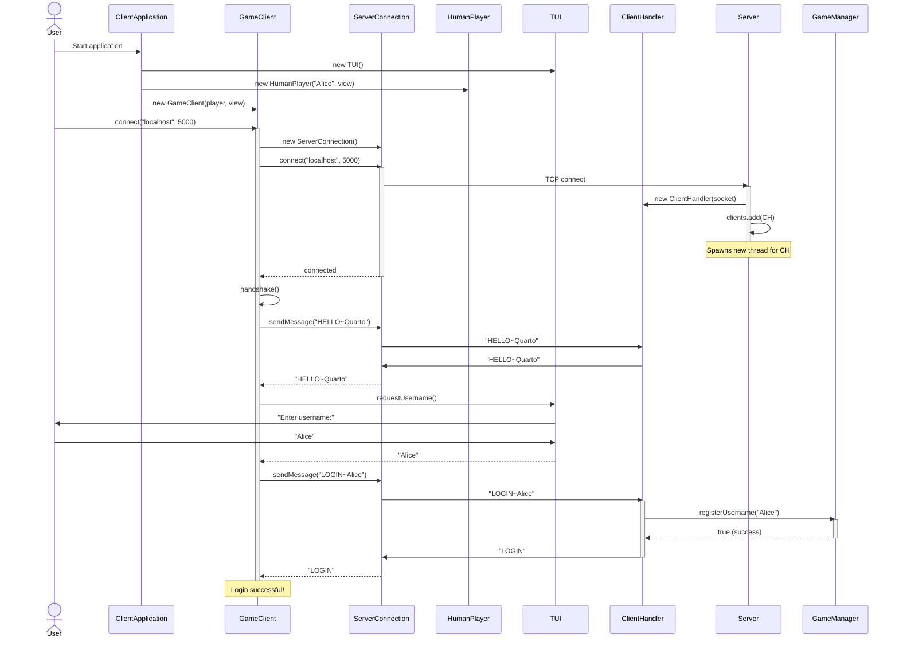
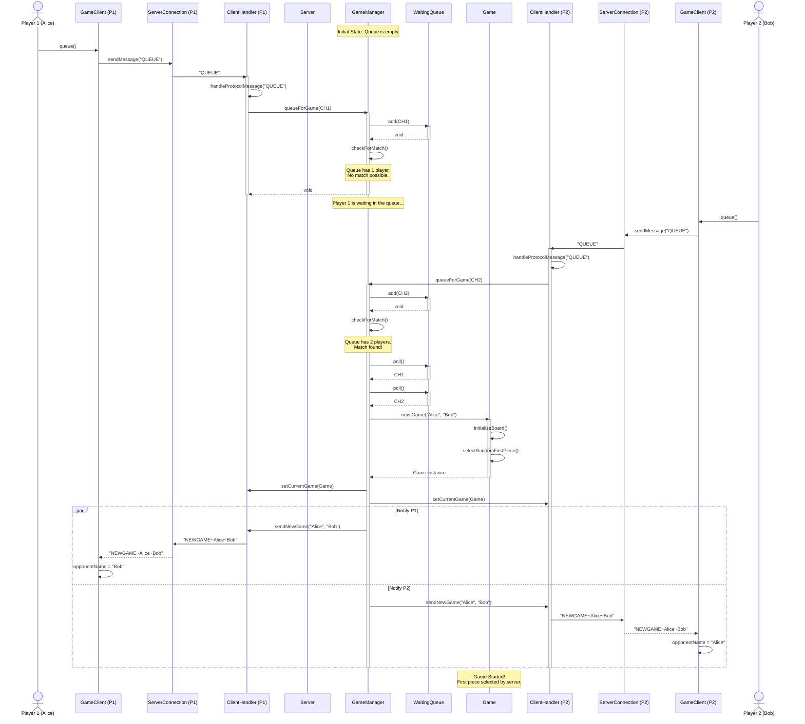
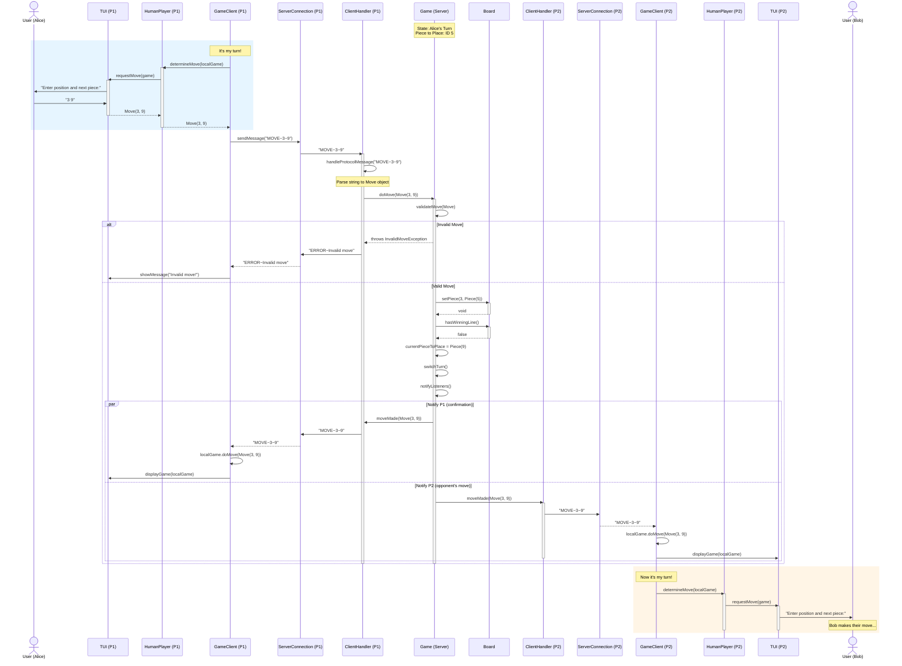
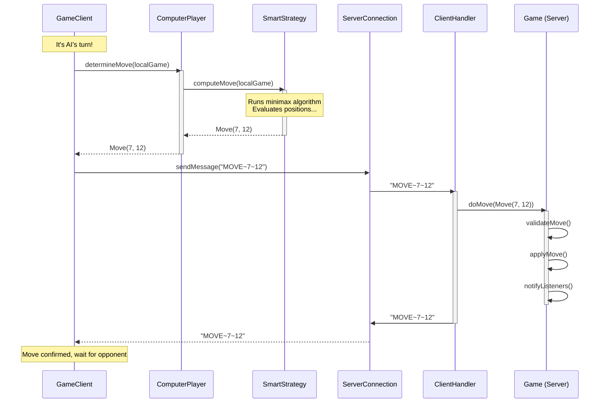
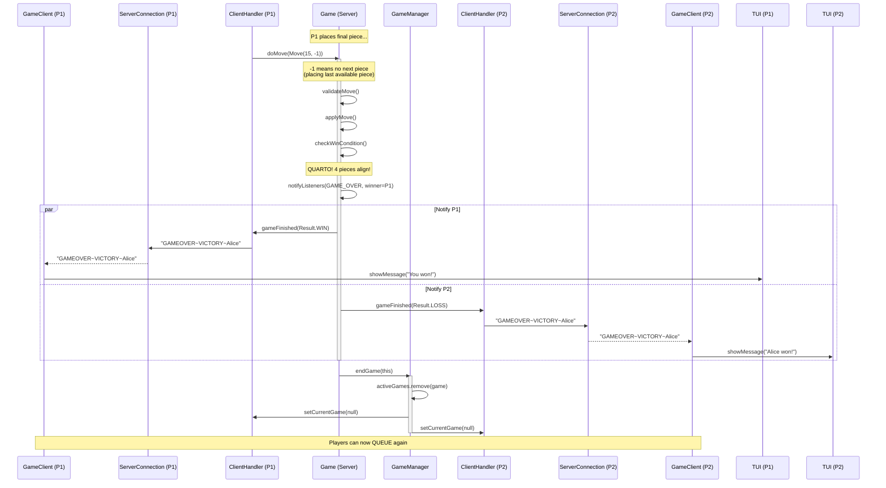

# Sequence Diagrams

## 1. Client Connection & Login

---

## 2. Queue Command Handling

---

## 3. Move Command Handling (Full Client-Server Flow)

---

## 4. AI Client Move (ComputerPlayer)

---

## 5. Game End Handling

