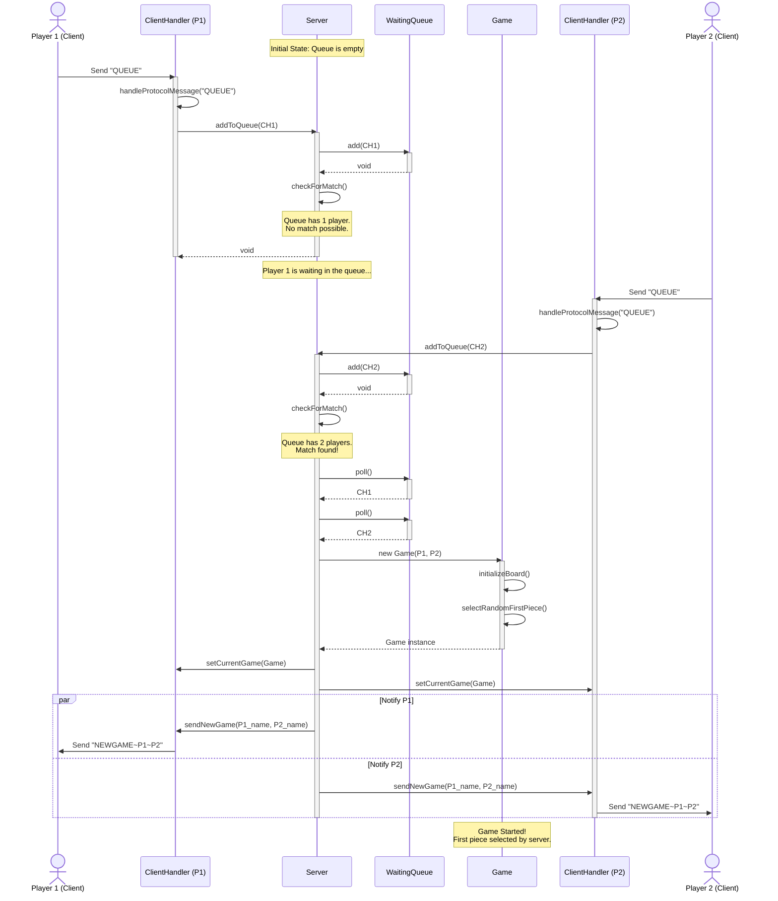
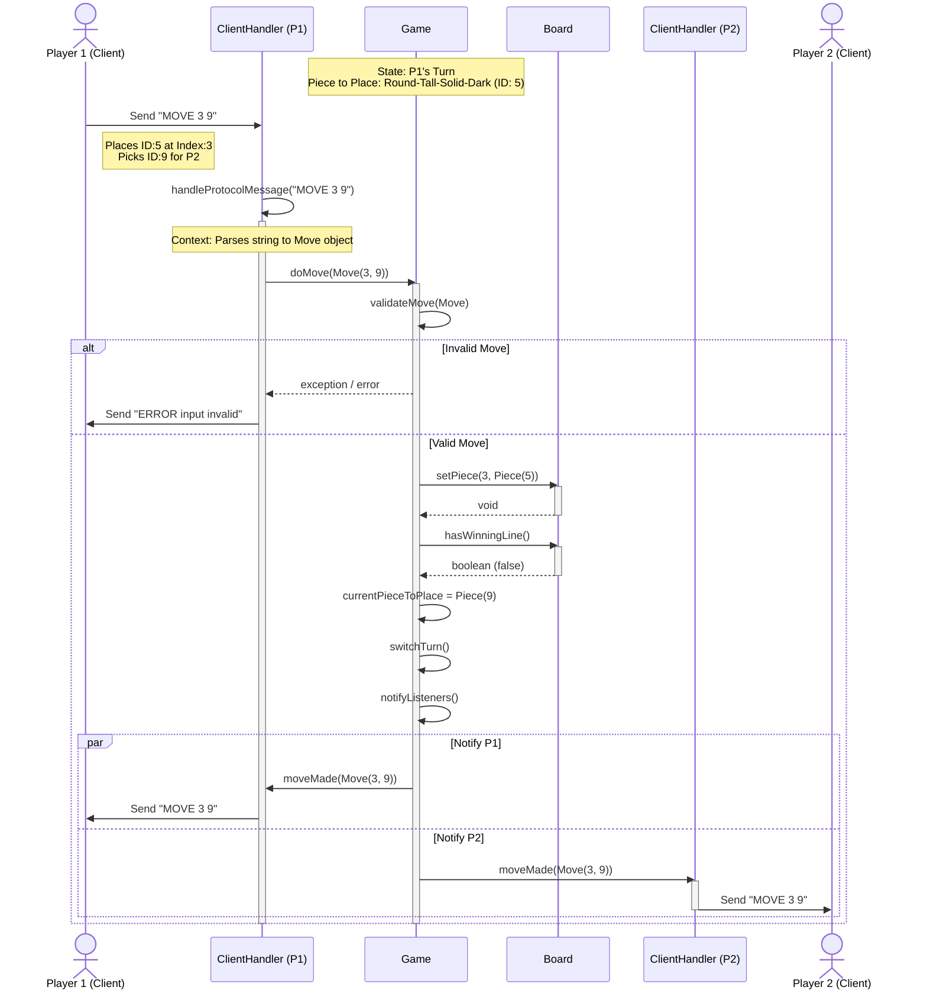

# Sequence Diagrams

## 1. Queue Command Handling

```mermaid
sequenceDiagram
    actor P1 as Player 1 (Client)
    participant CH1 as ClientHandler (P1)
    participant S as Server
    participant Q as WaitingQueue
    participant Game as Game
    participant CH2 as ClientHandler (P2)
    actor P2 as Player 2 (Client)

    Note over S: Initial State: Queue is empty

    P1->>CH1: Send "QUEUE"
    activate CH1
    CH1->>CH1: handleProtocolMessage("QUEUE")
    CH1->>S: addToQueue(CH1)
    activate S
    S->>Q: add(CH1)
    activate Q
    Q-->>S: void
    deactivate Q
    S->>S: checkForMatch()
    Note over S: Queue has 1 player.<br/>No match possible.
    S-->>CH1: void
    deactivate S
    deactivate CH1

    Note over S: Player 1 is waiting in the queue...

    P2->>CH2: Send "QUEUE"
    activate CH2
    CH2->>CH2: handleProtocolMessage("QUEUE")
    CH2->>S: addToQueue(CH2)
    activate S
    S->>Q: add(CH2)
    activate Q
    Q-->>S: void
    deactivate Q
    
    S->>S: checkForMatch()
    Note over S: Queue has 2 players.<br/>Match found!
    
    S->>Q: poll()
    activate Q
    Q-->>S: CH1
    deactivate Q
    S->>Q: poll()
    activate Q
    Q-->>S: CH2
    deactivate Q

    S->>Game: new Game(P1, P2)
    activate Game
    Game->>Game: initializeBoard()
    Game->>Game: selectRandomFirstPiece()
    Game-->>S: Game instance
    deactivate Game

    S->>CH1: setCurrentGame(Game)
    S->>CH2: setCurrentGame(Game)
    
    par Notify P1
        S->>CH1: sendNewGame(P1_name, P2_name)
        CH1->>P1: Send "NEWGAME~P1~P2"
    and Notify P2
        S->>CH2: sendNewGame(P1_name, P2_name)
        CH2->>P2: Send "NEWGAME~P1~P2"
    end
    
    deactivate S
    deactivate CH2

    Note over Game: Game Started!<br/>First piece selected by server.
```

---

## 2. Move Command Handling

```mermaid
sequenceDiagram
    actor P1 as Player 1 (Client)
    participant CH1 as ClientHandler (P1)
    participant Game as Game
    participant Board as Board
    participant CH2 as ClientHandler (P2)
    actor P2 as Player 2 (Client)

    Note over Game: State: P1's Turn<br/>Piece to Place: Round-Tall-Solid-Dark (ID: 5)

    P1->>CH1: Send "MOVE 3 9"
    Note right of P1: Places ID:5 at Index:3<br/>Picks ID:9 for P2
    
    CH1->>CH1: handleProtocolMessage("MOVE 3 9")
    activate CH1
    
    Note over CH1: Context: Parses string to Move object
    
    CH1->>Game: doMove(Move(3, 9))
    activate Game
    
    Game->>Game: validateMove(Move)
    alt Invalid Move
        Game-->>CH1: exception / error
        CH1->>P1: Send "ERROR input invalid"
    else Valid Move
        Game->>Board: setPiece(3, Piece(5))
        activate Board
        Board-->>Game: void
        deactivate Board
        
        Game->>Board: hasWinningLine()
        activate Board
        Board-->>Game: boolean (false)
        deactivate Board
        
        Game->>Game: currentPieceToPlace = Piece(9)
        Game->>Game: switchTurn()
        
        Game->>Game: notifyListeners()
        
        par Notify P1
            Game->>CH1: moveMade(Move(3, 9))
            CH1->>P1: Send "MOVE 3 9"
        and Notify P2
            Game->>CH2: moveMade(Move(3, 9))
            activate CH2
            CH2->>P2: Send "MOVE 3 9"
            deactivate CH2
        end
    end
    
    deactivate Game
    deactivate CH1
```
