```mermaid
classDiagram
    %% --- Networking Base Classes ---
    namespace networking {
        class SocketConnection {
            <<abstract>>
            -Socket socket
            -BufferedReader in
            -BufferedWriter out
            -boolean started
            #SocketConnection(Socket socket)
            #SocketConnection(String host, int port)
            #start()
            +sendMessage(String message) boolean
            #close()
            #handleStart()
            #handleMessage(String message)* void
            #handleDisconnect()* void
        }

        class SocketServer {
            <<abstract>>
            -ServerSocket serverSocket
            #SocketServer(int port)
            #getPort() int
            #acceptConnections()
            #close()
            #handleConnection(Socket socket)* void
        }
    }

    %% --- Shared Game Logic (Model) ---
    namespace model {
        class Game {
            -Board board
            -List~Piece~ availablePieces
            -Piece currentPieceToPlace
            -ClientHandler[] players
            -int currentTurn
            -List~GameListener~ listeners
            +Game(ClientHandler p1, ClientHandler p2)
            +start()
            +doMove(Move move)
            +getValidMoves() List~Move~
            +addListener(GameListener listener)
            -notifyListeners()
        }

        class Board {
            -Piece[] fields
            +getPiece(int index) Piece
            +setPiece(int index, Piece piece)
            +hasWinningLine() boolean
            +isFull() boolean
            +copy() Board
        }

        class Move {
            +int boardIndex
            +int pieceId
        }

        class Piece {
            +int id
            +boolean isTall
            +boolean isSolid
            +boolean isDark
            +boolean isRound
            +hasCommonTrait(Piece other) boolean
        }

        class GameListener {
            <<interface>>
            +moveMade(Move move) void
            +gameFinished(Game game) void
        }

        class AbstractPlayer {
            <<abstract>>
            -String name
            +determineMove(Game game)* Move
            +getName() String
        }
    }

    %% --- Server Side ---
    namespace server {
        class Server {
            -List~ClientHandler~ clients
            -GameManager gameManager
            -boolean running
            +Server(int port)
            +create(int port)$ Server
            +run()
            +stop()
            #handleConnection(Socket socket)
        }

        class GameManager {
            -Queue~ClientHandler~ waitingQueue
            -Map~String,ClientHandler~ loggedInUsers
            -List~Game~ activeGames
            +registerUsername(String name, ClientHandler client) boolean
            +releaseUsername(String name)
            +getLoggedInUsers() List~String~
            +queueForGame(ClientHandler client)
            +removeFromQueue(ClientHandler client)
            +createGame(ClientHandler p1, ClientHandler p2) Game
            +endGame(Game game, String reason, String winner)
            +handleDisconnect(ClientHandler client)
        }

        class ServerConnection {
            -ClientHandler clientHandler
            +ServerConnection(Socket socket)
            +setClientHandler(ClientHandler handler)
            #handleMessage(String message)
            #handleDisconnect()
            +sendHello(String desc)
            +sendLogin()
            +sendAlreadyLoggedIn()
            +sendList(String[] users)
            +sendNewGame(String p1, String p2)
            +sendMove(int pos, int pieceId)
            +sendFirstMove(int pieceId)
            +sendGameOver(String reason, String winner)
            +sendError(String msg)
        }

        class ClientHandler {
            -ServerConnection connection
            -GameManager gameManager
            -String playerName
            -Game currentGame
            -ClientState state
            -List~String~ supportedExtensions
            +ClientHandler(Socket socket, GameManager gm)
            +start()
            +receiveHello(String desc, String[] exts)
            +receiveLogin(String name)
            +receiveList()
            +receiveQueue()
            +receiveFirstMove(int pieceId)
            +receiveMove(int pos, int pieceId)
            +receiveDisconnect()
            +startGame(Game game, String opponent)
            +sendNewGame(String p1, String p2)
        }

        class ClientState {
            <<enumeration>>
            CONNECTED
            HELLO_RECEIVED
            LOGGED_IN
            IN_QUEUE
            IN_GAME
        }
        
        class GameSession {
             -Game game
             -ClientHandler player1
             -ClientHandler player2
        }
        
        class ServerPlayer {
             +ServerPlayer(String name)
             +determineMove(Game game) Move
        }
    }

    %% --- Client Side ---
    namespace client {
        class ClientApplication {
            +main(args)
        }
        
        class AIClientApplication {
            +main(args)
        }

        class ClientConnection {
            -GameClient gameClient
            +ClientConnection(String host, int port)
            +setGameClient(GameClient client)
            #handleMessage(String message)
            #handleDisconnect()
            +sendHello(String desc)
            +sendLogin(String username)
            +sendList()
            +sendQueue()
            +sendMove(int pos, int pieceId)
            +sendFirstMove(int pieceId)
        }

        class GameClient {
            -ClientConnection connection
            -String playerName
            -Game localGame
            -ClientView view
            -boolean loggedIn
            -boolean inQueue
            -boolean inGame
            +GameClient(String host, int port, ClientView view)
            +start()
            +receiveHello(String serverDesc)
            +receiveLogin()
            +receiveAlreadyLoggedIn()
            +receiveList(String[] users)
            +receiveNewGame(String p1, String p2)
            +receiveFirstMove(int pieceId)
            +receiveMove(int pos, int pieceId)
            +receiveGameOver(String reason, String winner)
            +receiveError(String error)
            +receiveDisconnect()
            +joinQueue()
            +leaveQueue()
            +requestPlayerList()
            +makeMove(int pos, int pieceId)
            +makeFirstMove(int pieceId)
            +disconnect()
        }
        
        class AIGameClient {
            +AIGameClient(String host, int port, AITUI view)
        }

        class HumanPlayer {
            -ClientView view
            +HumanPlayer(String name, ClientView view)
            +determineMove(Game game) Move
        }

        class ComputerPlayer {
            -Strategy strategy
            +ComputerPlayer(String name, Strategy strategy)
            +determineMove(Game game) Move
        }
        
        class ClientView {
            <<interface>>
            +displayGame(Game game)
            +promptUsername() String
            +requestMove(Game game) Move
            +showMessage(String msg)
            +showLoggedIn(String name)
            +showError(String error)
            +showDisconnected()
            +showUserList(String[] users)
            +showGameStarted(String p1, String p2, boolean first)
            +showMove(String[] parts)
            +showGameOver(String reason, String winner)
        }

        class TUI {
            +TUI()
            +run(GameClient client)
            +promptUsername() String
            +displayGame(Game game)
            #formatPiece(Piece p) String
            #printBoard(Game game)
        }
        
        class AITUI {
            +AITUI(GameClient client)
            +promptUsername() String
            +showLoggedIn(String name)
            +showGameOver(String reason, String winner)
        }
        
        class ConsoleUtils {
             +clearScreen()
             +printError(String msg)
             +printSuccess(String msg)
        }
    }

    %% --- AI Strategies ---
    namespace ai {
        class Strategy {
            <<interface>>
            +computeMove(Game game) Move
            +getName() String
        }

        class ChokerJokerStrategy {
            +computeMove(Game game) Move
            +determineMove(Game game) Move
            +initializeZobrist()
            +checkWin(...)
        }

        class MinimaxStrategy {
            +computeMove(Game game) Move
        }
    }

    %% === Relationships ===

    %% Networking Inheritance
    SocketConnection <|-- ServerConnection
    SocketConnection <|-- ClientConnection
    SocketServer <|-- Server

    %% Model Relationships
    Game *-- Board
    Game o-- Piece
    Game o-- GameListener
    AbstractPlayer ..> Move : creates
    Board o-- Piece

    %% Server Relationships
    Server *-- GameManager
    Server o-- ClientHandler
    ClientHandler *-- ServerConnection : uses
    ClientHandler ..|> GameListener : implements
    ClientHandler --> Game : plays in
    ClientHandler --> ClientState : has
    ServerConnection --> ClientHandler : delegates to
    GameManager o-- ClientHandler : queues
    GameManager o-- Game : manages
    GameManager o-- GameSession : manages
    ServerPlayer --|> AbstractPlayer

    %% Client Relationships
    ClientApplication --> GameClient
    AIClientApplication --> AIGameClient
    GameClient *-- ClientConnection : uses for network
    GameClient o-- ClientView
    GameClient o-- Game : localGame
    ClientConnection --> GameClient : delegates to
    AIGameClient --|> GameClient

    %% Player Inheritance
    AbstractPlayer <|-- HumanPlayer
    AbstractPlayer <|-- ComputerPlayer
    HumanPlayer o-- ClientView : uses for input
    ComputerPlayer o-- Strategy : delegates to

    %% View Implementation
    ClientView <|.. TUI
    ClientView <|.. AITUI
    TUI ..> ConsoleUtils : uses
    AITUI ..> ConsoleUtils : uses

    %% Strategy Implementations
    Strategy <|.. ChokerJokerStrategy
    Strategy <|.. MinimaxStrategy
```

---

## Architecture Overview

The system uses a layered architecture with a shared `Networking` package:

```
┌─────────────────────────────────────────────────────────┐
│                    Networking Package                    │
│  ┌─────────────────────┐    ┌─────────────────────┐     │
│  │  SocketConnection   │    │    SocketServer     │     │
│  │    (abstract)       │    │     (abstract)      │     │
│  └──────────┬──────────┘    └──────────┬──────────┘     │
└─────────────┼──────────────────────────┼────────────────┘
              │                          │
     ┌────────┴────────┐                 │
     │                 │                 │
┌────▼────┐      ┌─────▼─────┐     ┌─────▼─────┐
│ Client  │      │  Server   │     │  Server   │
│Connection│      │Connection │     │  (main)   │
└────┬────┘      └─────┬─────┘     └───────────┘
     │                 │
     │ delegates       │ delegates
     ▼                 ▼
┌──────────┐     ┌─────────────┐
│GameClient│     │ClientHandler│
└──────────┘     └─────────────┘
```

---

## Server System Documentation

### `Server` Class

Extends `SocketServer`. Entry point for the server application.

| Method                   | Description                                                              |
| ------------------------ | ------------------------------------------------------------------------ |
| `Server(int port)`       | Constructor that binds to the specified port.                            |
| `create(int port)`       | Static factory that prompts for new port if initial is unavailable.      |
| `run()`                  | Starts accepting connections. Blocks until `stop()` is called.           |
| `handleConnection(sock)` | Called for each new client. Creates `ClientHandler` and calls `start()`. |
| `stop()`                 | Closes the server socket and stops accepting connections.                |

---

### `ServerConnection` Class

Extends `SocketConnection`. Handles protocol parsing and delegates to `ClientHandler`.

| Method                 | Description                                                        |
| ---------------------- | ------------------------------------------------------------------ |
| `handleMessage(msg)`   | Parses protocol message, calls appropriate `receive*()` on handler |
| `handleDisconnect()`   | Notifies handler of disconnect                                     |
| `sendHello(desc)`      | Sends `HELLO~description`                                          |
| `sendLogin()`          | Sends `LOGIN` confirmation                                         |
| `sendNewGame(p1, p2)`  | Sends `NEWGAME~player1~player2`                                    |
| `sendMove(pos, piece)` | Sends `MOVE~position~pieceId`                                      |
| `sendGameOver(r, w)`   | Sends `GAMEOVER~reason~winner`                                     |
| `sendError(msg)`       | Sends `ERROR~message`                                              |

---

### `ClientHandler` Class

Business logic for a single client. Implements `GameListener`.

| Method                | Description                                   |
| --------------------- | --------------------------------------------- |
| `receiveHello(...)`   | Handles HELLO, responds with server HELLO     |
| `receiveLogin(name)`  | Registers username via GameManager            |
| `receiveQueue()`      | Toggles queue status                          |
| `receiveMove(...)`    | Validates and applies move to current game    |
| `receiveDisconnect()` | Cleans up via GameManager                     |
| `moveMade(move)`      | GameListener: forwards move to client         |
| `gameFinished(game)`  | GameListener: resets state, allows re-queuing |

---

## Client System Documentation

### `ClientConnection` Class

Extends `SocketConnection`. Handles protocol parsing and delegates to `GameClient`.

| Method                 | Description                                                       |
| ---------------------- | ----------------------------------------------------------------- |
| `handleMessage(msg)`   | Parses protocol message, calls appropriate `receive*()` on client |
| `handleDisconnect()`   | Notifies client of disconnect                                     |
| `sendHello(desc)`      | Sends `HELLO~description`                                         |
| `sendLogin(user)`      | Sends `LOGIN~username`                                            |
| `sendQueue()`          | Sends `QUEUE`                                                     |
| `sendMove(pos, piece)` | Sends `MOVE~position~pieceId`                                     |

---

### `GameClient` Class

Main client orchestrator. Manages connection state and local game.

| Method                 | Description                                        |
| ---------------------- | -------------------------------------------------- |
| `receiveHello(...)`    | Receives server hello, auto-sends LOGIN            |
| `receiveLogin()`       | Marks as logged in, notifies view                  |
| `receiveNewGame(...)`  | Creates new local Game, notifies view              |
| `receiveMove(...)`     | Applies move to local game                         |
| `receiveGameOver(...)` | Clears game state, can re-queue on same connection |
| `joinQueue()`          | Sends QUEUE to server                              |
| `makeMove(pos, piece)` | Sends move to server                               |

---

## Key Design Pattern: Delegation

Both client and server use a **delegation pattern**:

```
Connection (parsing) ──delegates to──> Handler (logic)
```

**Benefits:**

- Clean separation of networking and business logic
- Connection classes are reusable
- Easy to test handlers without network
- Same connection supports multiple games (stateless parsing)
