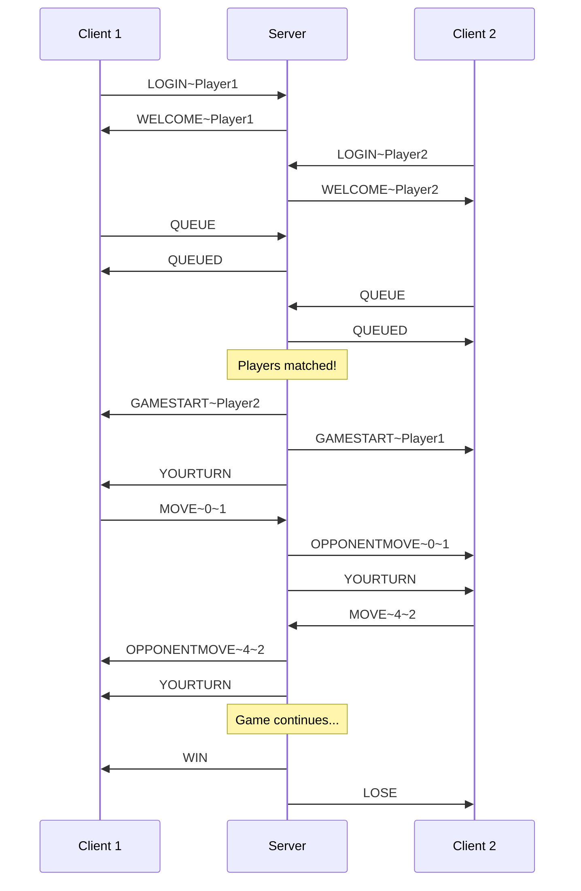

# Protocol Commands Documentation

> Comprehensive documentation of all network protocol commands used in the multiplayer board game project.

---

## Protocol Overview

All messages are transmitted as plain text, with commands and arguments separated by the tilde (`~`) character. Messages are sent line-by-line over TCP sockets.

**Message Format:**

```
COMMAND~arg1~arg2~...
```

**Separator:** `~` (defined in `Protocol.PROTOCOL.SEPARATOR`)

---

## Client → Server Commands

These commands are sent from the client to the server.

### `LOGIN`

Registers a player with a unique username on the server.

| Property             | Details                                                    |
| -------------------- | ---------------------------------------------------------- |
| **Direction**        | Client → Server                                            |
| **Format**           | `LOGIN~<username>`                                         |
| **Arguments**        | `username` (required): The desired username for the player |
| **Preconditions**    | Client must be connected to the server                     |
| **Success Response** | `WELCOME~<username>`                                       |
| **Error Responses**  | `ERROR~Username required` (if username missing)            |
|                      | `ERROR~Username already taken` (if username in use)        |

**Example:**

```
LOGIN~Player1
```

---

### `QUEUE`

Adds the player to the matchmaking queue to find an opponent.

| Property             | Details                                                                        |
| -------------------- | ------------------------------------------------------------------------------ |
| **Direction**        | Client → Server                                                                |
| **Format**           | `QUEUE`                                                                        |
| **Arguments**        | None                                                                           |
| **Preconditions**    | Player must be logged in (have sent a successful `LOGIN`)                      |
| **Success Response** | `QUEUED`                                                                       |
| **Error Response**   | `ERROR~Must login first`                                                       |
| **Side Effects**     | Server attempts to match players; if 2+ players are waiting, a game is created |

**Example:**

```
QUEUE
```

---

### `MOVE`

Submits a move during an active game.

| Property             | Details                                                          |
| -------------------- | ---------------------------------------------------------------- |
| **Direction**        | Client → Server                                                  |
| **Format**           | `MOVE~<boardIndex>~<pieceId>`                                    |
| **Arguments**        | `boardIndex` (required): The board position index (integer)      |
|                      | `pieceId` (required): The ID of the piece to place/use (integer) |
| **Preconditions**    | Player must be in an active game; it must be the player's turn   |
| **Success Response** | Move is validated and applied; opponent receives `OPPONENTMOVE`  |
| **Error Responses**  | `ERROR~Invalid move format` (if arguments missing)               |
|                      | `ERROR~Not in a game` (if player not in a game)                  |

**Example:**

```
MOVE~5~3
```

---

### `REMATCH_REQUEST`

Requests a rematch with the previous opponent after a game ends.

| Property             | Details                                                               |
| -------------------- | --------------------------------------------------------------------- |
| **Direction**        | Client → Server                                                       |
| **Format**           | `REMATCH_REQUEST`                                                     |
| **Arguments**        | None (opponent is determined from the previous game)                  |
| **Preconditions**    | Game must have just ended                                             |
| **Success Response** | If opponent also requested: new game starts with `GAMESTART` messages |
| **Side Effects**     | Server notifies opponent of rematch request                           |

**Example:**

```
REMATCH_REQUEST
```

---

### `REMATCH_ACCEPT`

Accepts a pending rematch request from an opponent.

| Property             | Details                                              |
| -------------------- | ---------------------------------------------------- |
| **Direction**        | Client → Server                                      |
| **Format**           | `REMATCH_ACCEPT`                                     |
| **Arguments**        | None                                                 |
| **Preconditions**    | Must have received a `REMATCH_REQUEST` from opponent |
| **Success Response** | New game starts; both players receive `GAMESTART`    |

---

### `REMATCH_DENY`

Declines a pending rematch request.

| Property          | Details                                              |
| ----------------- | ---------------------------------------------------- |
| **Direction**     | Client → Server                                      |
| **Format**        | `REMATCH_DENY`                                       |
| **Arguments**     | None                                                 |
| **Preconditions** | Must have received a `REMATCH_REQUEST` from opponent |
| **Side Effects**  | Rematch request is cleared                           |

---

### `CHAT`

Sends a chat message (if chat extension is implemented).

| Property          | Details                                        |
| ----------------- | ---------------------------------------------- |
| **Direction**     | Client → Server                                |
| **Format**        | `CHAT~<message>`                               |
| **Arguments**     | `message` (required): The text content to send |
| **Preconditions** | Player must be logged in                       |
| **Note**          | This is an optional protocol extension         |

**Example:**

```
CHAT~Hello, good luck!
```

---

### `JOIN` / `LEAVE`

Queue management commands (may be used for named queues extension).

| Command | Format             | Description                                           |
| ------- | ------------------ | ----------------------------------------------------- |
| `JOIN`  | `JOIN~<queueName>` | Join a named queue to play against specific opponents |
| `LEAVE` | `LEAVE`            | Leave the current queue                               |

---

## Server → Client Commands

These commands are sent from the server to the client.

### `WELCOME`

Confirms successful login with the registered username.

| Property       | Details                                          |
| -------------- | ------------------------------------------------ |
| **Direction**  | Server → Client                                  |
| **Format**     | `WELCOME~<username>`                             |
| **Arguments**  | `username`: The successfully registered username |
| **Sent After** | Successful `LOGIN` command                       |

**Example:**

```
WELCOME~Player1
```

---

### `QUEUED`

Confirms the player has been added to the matchmaking queue.

| Property       | Details                    |
| -------------- | -------------------------- |
| **Direction**  | Server → Client            |
| **Format**     | `QUEUED`                   |
| **Arguments**  | None                       |
| **Sent After** | Successful `QUEUE` command |

---

### `GAMESTART`

Notifies the player that a game has begun.

| Property       | Details                                      |
| -------------- | -------------------------------------------- |
| **Direction**  | Server → Client                              |
| **Format**     | `GAMESTART~<opponentName>`                   |
| **Arguments**  | `opponentName`: The username of the opponent |
| **Sent After** | Two players are matched from the queue       |
| **Note**       | Both players receive this message            |

**Example:**

```
GAMESTART~Player2
```

---

### `YOURTURN`

Indicates it is the player's turn to make a move.

| Property       | Details                                                |
| -------------- | ------------------------------------------------------ |
| **Direction**  | Server → Client                                        |
| **Format**     | `YOURTURN`                                             |
| **Arguments**  | None                                                   |
| **Sent After** | Game starts (to first player) or after opponent's move |

---

### `OPPONENTMOVE`

Notifies the player of their opponent's move.

| Property       | Details                                                |
| -------------- | ------------------------------------------------------ |
| **Direction**  | Server → Client                                        |
| **Format**     | `OPPONENTMOVE~<boardIndex>~<pieceId>`                  |
| **Arguments**  | `boardIndex`: The board position of the move (integer) |
|                | `pieceId`: The piece ID used in the move (integer)     |
| **Sent After** | Opponent makes a valid move                            |

**Example:**

```
OPPONENTMOVE~5~3
```

---

### `WIN`

Notifies the player they have won the game.

| Property       | Details                               |
| -------------- | ------------------------------------- |
| **Direction**  | Server → Client                       |
| **Format**     | `WIN`                                 |
| **Arguments**  | None                                  |
| **Sent After** | Game ends with this player victorious |

---

### `LOSE`

Notifies the player they have lost the game.

| Property       | Details                            |
| -------------- | ---------------------------------- |
| **Direction**  | Server → Client                    |
| **Format**     | `LOSE`                             |
| **Arguments**  | None                               |
| **Sent After** | Game ends with opponent victorious |

---

### `TIE`

Notifies the player the game ended in a draw.

| Property       | Details                           |
| -------------- | --------------------------------- |
| **Direction**  | Server → Client                   |
| **Format**     | `TIE`                             |
| **Arguments**  | None                              |
| **Sent After** | Game ends in a draw/tie condition |

---

### `ERROR`

Notifies the player of an error condition.

| Property            | Details                                                                                                                                                |
| ------------------- | ------------------------------------------------------------------------------------------------------------------------------------------------------ |
| **Direction**       | Server → Client                                                                                                                                        |
| **Format**          | `ERROR~<message>`                                                                                                                                      |
| **Arguments**       | `message`: Human-readable error description                                                                                                            |
| **Common Messages** | `Username required`, `Username already taken`, `Must login first`, `Invalid move format`, `Not in a game`, `Unknown command`, `Invalid message format` |

**Example:**

```
ERROR~Username already taken
```

---

## Command Summary Table

| Command           | Direction | Arguments               | Description                     |
| ----------------- | --------- | ----------------------- | ------------------------------- |
| `LOGIN`           | C → S     | `username`              | Register with a unique username |
| `QUEUE`           | C → S     | None                    | Join matchmaking queue          |
| `MOVE`            | C → S     | `boardIndex`, `pieceId` | Make a game move                |
| `CHAT`            | C → S     | `message`               | Send chat message (extension)   |
| `JOIN`            | C → S     | `queueName`             | Join named queue (extension)    |
| `LEAVE`           | C → S     | None                    | Leave current queue             |
| `REMATCH_REQUEST` | C → S     | None                    | Request rematch                 |
| `REMATCH_ACCEPT`  | C → S     | None                    | Accept rematch                  |
| `REMATCH_DENY`    | C → S     | None                    | Decline rematch                 |
| `WELCOME`         | S → C     | `username`              | Login successful                |
| `QUEUED`          | S → C     | None                    | Added to queue                  |
| `GAMESTART`       | S → C     | `opponentName`          | Game begins                     |
| `YOURTURN`        | S → C     | None                    | Player's turn                   |
| `OPPONENTMOVE`    | S → C     | `boardIndex`, `pieceId` | Opponent made move              |
| `WIN`             | S → C     | None                    | Player wins                     |
| `LOSE`            | S → C     | None                    | Player loses                    |
| `TIE`             | S → C     | None                    | Game is a draw                  |
| `ERROR`           | S → C     | `message`               | Error occurred                  |

---

## Typical Communication Flow



---
