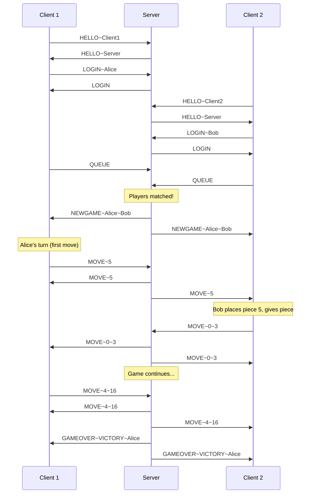

# Quarto Protocol Commands Documentation

> Official protocol specification for the Quarto multiplayer board game (TCS Module 2, 2025/2026).

---

## Protocol Overview

All messages are plain text, with commands and arguments separated by a tilde (`~`). Commands are terminated by a newline (`\n`).

**Message Format:**

```
COMMAND~arg1~arg2~...
```

**Argument Notation:**

- `<arg>` — required
- `[arg]` — optional
- `[arg]*` — zero or more
- `[arg]+` — one or more

---

## Core Commands

### Handshake Sequence

The handshake must complete before any other commands. **Client initiates.**

```
Client                          Server
  |                               |
  |--- HELLO~desc[~extensions] -->|
  |<-- HELLO~desc[~extensions] ---|
  |--- LOGIN~username ----------->|
  |<-- LOGIN (or ALREADYLOGGEDIN)-|
  |                               |
     Handshake Complete ✓
```

---

## Client → Server Commands

### `HELLO`

Initiates handshake. Sent immediately after connecting.

| Property      | Details                                                           |
| ------------- | ----------------------------------------------------------------- |
| **Format**    | `HELLO~<description>[~extension]*`                                |
| **Arguments** | `description`: human-readable client name                         |
|               | `extension`: optional supported extensions (e.g., `CHAT`, `RANK`) |

**Examples:**

```
HELLO~MyClient
HELLO~Alice's Client~CHAT~RANK
```

---

### `LOGIN`

Claims a username after the server's HELLO response.

| Property     | Details                                                 |
| ------------ | ------------------------------------------------------- |
| **Format**   | `LOGIN~<username>`                                      |
| **Response** | `LOGIN` (success) or `ALREADYLOGGEDIN` (username taken) |

**Examples:**

```
LOGIN~Alice
LOGIN~Johnny Flodder
```

---

### `LIST`

Requests list of all logged-in users.

| Property     | Details            |
| ------------ | ------------------ |
| **Format**   | `LIST`             |
| **Response** | `LIST[~username]*` |

---

### `QUEUE`

Joins or leaves the matchmaking queue. Sending again toggles queue status.

| Property   | Details                                                  |
| ---------- | -------------------------------------------------------- |
| **Format** | `QUEUE`                                                  |
| **Note**   | No server response. Server sends `NEWGAME` when matched. |

---

### `MOVE`

Submits a move during the game. Only valid on your turn.

| Property       | Details                                                   |
| -------------- | --------------------------------------------------------- |
| **First Move** | `MOVE~<pieceId>` — give a piece (0-15) to opponent        |
| **Subsequent** | `MOVE~<position>~<pieceId>` — place piece, then give next |

**Position/Piece Values:**

- `0-15`: Valid board position or piece ID
- `16`: Claim Quarto (M only)
- `17`: Place last piece without claiming Quarto (final move only)

**Board Layout (positions 0-15):**

```
 3 |  2 |  7 |  1
---+----+----+---
 6 | 11 |  0 |  5
---+----+----+---
10 | 15 |  4 |  9
---+----+----+---
14 |  8 | 13 | 12
```

**Piece Encoding (0-15):**

| Code | Color | Size  | Shape  | Fill   |
| ---- | ----- | ----- | ------ | ------ |
| 0    | light | small | round  | solid  |
| 1    | dark  | small | round  | solid  |
| 2    | light | large | round  | solid  |
| 3    | dark  | large | round  | solid  |
| 4    | light | small | square | solid  |
| 5    | dark  | small | square | solid  |
| 6    | light | large | square | solid  |
| 7    | dark  | large | square | solid  |
| 8    | light | small | round  | hollow |
| 9    | dark  | small | round  | hollow |
| 10   | light | large | round  | hollow |
| 11   | dark  | large | round  | hollow |
| 12   | light | small | square | hollow |
| 13   | dark  | small | square | hollow |
| 14   | light | large | square | hollow |
| 15   | dark  | large | square | hollow |

---

## Server → Client Commands

### `HELLO`

Server response to client's HELLO.

| Property   | Details                            |
| ---------- | ---------------------------------- |
| **Format** | `HELLO~<description>[~extension]*` |

---

### `LOGIN`

Confirms successful login. Marks end of handshake.

| Property   | Details |
| ---------- | ------- |
| **Format** | `LOGIN` |

---

### `ALREADYLOGGEDIN`

Username is already taken.

| Property   | Details           |
| ---------- | ----------------- |
| **Format** | `ALREADYLOGGEDIN` |

---

### `LIST`

Returns all logged-in users.

| Property   | Details            |
| ---------- | ------------------ |
| **Format** | `LIST[~username]*` |

**Examples:**

```
LIST~Alice
LIST~Charlie~Alice~Bob
```

---

### `NEWGAME`

Notifies players a game has started. First player listed moves first.

| Property   | Details                       |
| ---------- | ----------------------------- |
| **Format** | `NEWGAME~<player1>~<player2>` |

**Example:**

```
NEWGAME~Alice~Bob
```

---

### `MOVE`

Broadcasts a move to all players in the game.

| Property   | Details                      |
| ---------- | ---------------------------- |
| **Format** | `MOVE~<N>` or `MOVE~<N>~<M>` |

---

### `GAMEOVER`

Game has ended.

| Property    | Details                         |
| ----------- | ------------------------------- |
| **Format**  | `GAMEOVER~<reason>[~winner]`    |
| **Reasons** | `VICTORY`, `DRAW`, `DISCONNECT` |

**Examples:**

```
GAMEOVER~VICTORY~Alice
GAMEOVER~DRAW
GAMEOVER~DISCONNECT~Bob
```

---

### `ERROR`

Protocol violation occurred.

| Property   | Details                                               |
| ---------- | ----------------------------------------------------- |
| **Format** | `ERROR[~description]`                                 |
| **Note**   | Description is for debugging only, never show to user |

---

## Command Summary

| Command           | Direction | Format                       |
| ----------------- | --------- | ---------------------------- |
| `HELLO`           | C↔S       | `HELLO~<desc>[~ext]*`        |
| `LOGIN`           | C→S       | `LOGIN~<username>`           |
| `LOGIN`           | S→C       | `LOGIN`                      |
| `ALREADYLOGGEDIN` | S→C       | `ALREADYLOGGEDIN`            |
| `LIST`            | C→S       | `LIST`                       |
| `LIST`            | S→C       | `LIST[~user]*`               |
| `QUEUE`           | C→S       | `QUEUE`                      |
| `NEWGAME`         | S→C       | `NEWGAME~<p1>~<p2>`          |
| `MOVE`            | C→S       | `MOVE~<N>[~<M>]`             |
| `MOVE`            | S→C       | `MOVE~<N>[~<M>]`             |
| `GAMEOVER`        | S→C       | `GAMEOVER~<reason>[~winner]` |
| `ERROR`           | C↔S       | `ERROR[~desc]`               |

---

## Extensions (Optional)

### CHAT Extension

- `CHAT~<message>` (client → broadcast)
- `CHAT~<sender>~<message>` (server → clients)
- `WHISPER~<recipient>~<message>` (private)
- `CANNOTWHISPER~<recipient>` (delivery failed)
- Requires escape characters: `\~` and `\\`

### RANK Extension

- `RANK` (client request)
- `RANK[~username~score]*` (server response)

### NAMEDQUEUES Extension

- `QUEUE[~name]` (join named queue)

### NOISE Extension

- Encryption using Noise protocol
- `WRONGKEY` (authentication failed)

---

## Typical Game Flow


